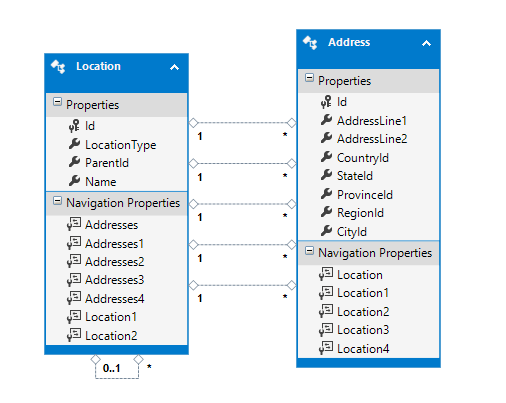
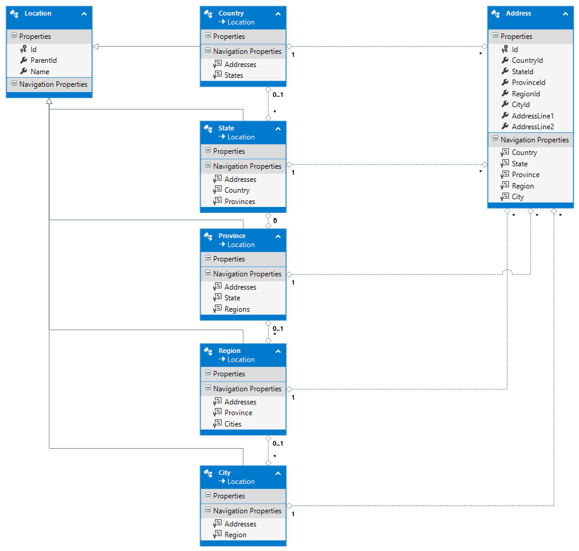

# AddressHierarchy

Representación de una dirección (calle, ciudad, provincia, etc.) usando [una tabla por jerarquía](https://msdn.microsoft.com/es-es/data/jj618292.aspx) en Entity Framework 6. 

## Base de datos

### Tabla Location  
Representa una localidad (ciudad, provincia, etc.)

```
CREATE TABLE [dbo].[Location] (tion] ([Id])
);
    [Id]           INT            IDENTITY (1, 1) NOT NULL,
    [LocationType] INT            NOT NULL,
    [ParentId]     INT            NULL,
    [Name]         NVARCHAR (128) NOT NULL,
    PRIMARY KEY CLUSTERED ([Id] ASC),
    CONSTRAINT [FK_Location_Location] FOREIGN KEY ([ParentId]) REFERENCES [dbo].[Loca

CREATE NONCLUSTERED INDEX [IX_Location_LocationType]
    ON [dbo].[Location]([LocationType] ASC);

```

### Tabla Address
Representa una dirección

```
CREATE TABLE [dbo].[Address] (
    [Id]            INT            IDENTITY (1, 1) NOT NULL,
	[AddressLine1]	NVARCHAR(50)   NOT NULL,	
	[AddressLine2]	NVARCHAR(50)   NULL,	
    [CountryId]     INT            NOT NULL,
    [StateId]       INT            NOT NULL,
    [ProvinceId]    INT            NOT NULL,
    [RegionId]      INT            NOT NULL,
    [CityId]        INT            NOT NULL,
    PRIMARY KEY CLUSTERED ([Id] ASC),
    CONSTRAINT [FK_Address_LocationCountry] FOREIGN KEY ([CountryId]) REFERENCES [dbo].[Location] ([Id]),
    CONSTRAINT [FK_Address_LocationRegion] FOREIGN KEY ([RegionId]) REFERENCES [dbo].[Location] ([Id]),
    CONSTRAINT [FK_Address_LocationProvince] FOREIGN KEY ([ProvinceId]) REFERENCES [dbo].[Location] ([Id]),
    CONSTRAINT [FK_Address_LocationCity] FOREIGN KEY ([CityId]) REFERENCES [dbo].[Location] ([Id]),
    CONSTRAINT [FK_Address_LocationState] FOREIGN KEY ([StateId]) REFERENCES [dbo].[Location] ([Id])
);
```

## Modelo conceptual

### Tipos de localidades 

```
public enum LocationTypes
{
    Country = 1,
    State = 2, // Comunidad Autónoma
    Province = 3,
    Region = 4, // Comarca
    City = 5 // Municipio
}
```

### Modelo inicial
Representación de la base de datos



### Modelo final
Representación de la jerarquía



### Pasos para llegar del modelo inicial al modelo final 

