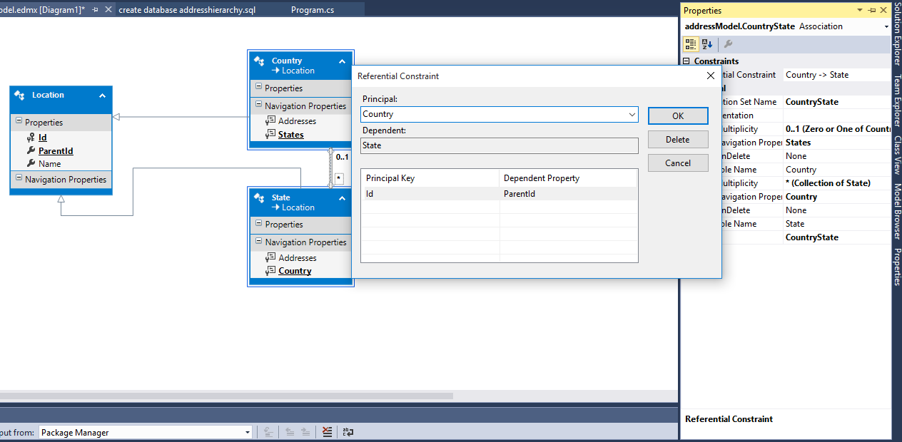

# AddressHierarchy

Representación de una dirección (calle, ciudad, provincia, etc.) usando [una tabla por jerarquía](https://msdn.microsoft.com/es-es/data/jj618292.aspx) en Entity Framework 6. 

## Base de datos

### Tabla Location  
Representa una localidad (ciudad, provincia, etc.)

```
CREATE TABLE [dbo].[Location] (
    [Id]           INT            IDENTITY (1, 1) NOT NULL,
    [LocationType] INT            NOT NULL,
    [ParentId]     INT            NULL,
    [Name]         NVARCHAR (128) NOT NULL,
    PRIMARY KEY CLUSTERED ([Id] ASC),
    CONSTRAINT [FK_Location_Location] FOREIGN KEY ([ParentId]) REFERENCES [dbo].[Location] ([Id])
);

CREATE NONCLUSTERED INDEX [IX_Location_LocationType]
    ON [dbo].[Location]([LocationType] ASC);

```

### Tabla Address
Representa una dirección

```
CREATE TABLE [dbo].[Address] (
    [Id]            INT            IDENTITY (1, 1) NOT NULL,
	[AddressLine1]	NVARCHAR(50)   NOT NULL,	
	[AddressLine2]	NVARCHAR(50)   NULL,	
    [CountryId]     INT            NOT NULL,
    [StateId]       INT            NOT NULL,
    [ProvinceId]    INT            NOT NULL,
    [RegionId]      INT            NOT NULL,
    [CityId]        INT            NOT NULL,
    PRIMARY KEY CLUSTERED ([Id] ASC),
    CONSTRAINT [FK_Address_LocationCountry] FOREIGN KEY ([CountryId]) REFERENCES [dbo].[Location] ([Id]),
    CONSTRAINT [FK_Address_LocationState] FOREIGN KEY ([StateId]) REFERENCES [dbo].[Location] ([Id]),
    CONSTRAINT [FK_Address_LocationRegion] FOREIGN KEY ([RegionId]) REFERENCES [dbo].[Location] ([Id]),
    CONSTRAINT [FK_Address_LocationProvince] FOREIGN KEY ([ProvinceId]) REFERENCES [dbo].[Location] ([Id]),
    CONSTRAINT [FK_Address_LocationCity] FOREIGN KEY ([CityId]) REFERENCES [dbo].[Location] ([Id])
);
```

## Modelo conceptual

### Tipos de localidades 

```
public enum LocationTypes
{
    Country = 1,
    State = 2, // Comunidad Autónoma
    Province = 3,
    Region = 4, // Comarca
    City = 5 // Municipio
}
```

### Modelo inicial
Representación de la base de datos


### Modelo final
Representación de la jerarquía


### Pasos para llegar del modelo inicial al modelo final 
1. Eliminar todas las asociaciones de la entidad **Location** con la entidad **Address** y con ella misma. 

2. Declarar abstracta la entidad **Location** y crear las entidades **Country**, **State**, **Province**, **Region** y **City**, indicando que **Location** es su tipo base. 
  - Guiarse por los pasos en [EF Designer TPH Inheritance](https://msdn.microsoft.com/es-es/data/jj618292.aspx). 
  - Usar como discriminador la propiedad **LocationType**, empleando los valores definidos en la enumeración **LocationTypes** (ver arriba).
  - Las nuevas entidades no tendrán ninguna propiedad propia.

3. Crear asociaciones entre cada entidad nueva con la entidad **Address**, como se muestra en las imágenes.
  - Desmarcar la opción de crear la "foreign key" en la entidad **Address**
  

  - Después de crear la asociación, ir a sus propiedades y configurar la "foreign key" para que coincida con la ya definida en la base de datos.
  

4. Crear asociaciones entre las entidades nuevas para reprentar la relación padre-hijo, por ejemplo entre **Country** y **State**, como se muestra en las imágenes.
  - En la multiplicidad de la entidad hija indicar 0..1 (porque el campo ParentId admite NULL)
  - Desmarcar la opción de crear la "foreign key" en la entidad hija
  

  - Después de crear la asociación, ir a sus propiedades y configurar la "foreign key" para que coincida con la ya definida en la base de datos.
  


## Uso del modelo

### Listar todas las localidades localidades

```
void ListAllLocations()
{
    using (var db = new addressEntities())
    {
        foreach (var country in db.Locations.OfType<Country>())
        {
            Console.WriteLine("Country: {0}", country.Name);
            foreach (var state in country.States.OrderBy(s => s.Name))
            {
                Console.WriteLine("  State: {0}", state.Name);
                foreach (var province in state.Provinces.OrderBy(p => p.Name))
                {
                    Console.WriteLine("    Province: {0}", province.Name);
                    foreach (var region in province.Regions.OrderBy(r => r.Name))
                    {
                        Console.WriteLine("      Region: {0}", region.Name);
                        foreach (var city in region.Cities.OrderBy(c => c.Name))
                        {
                            Console.WriteLine("        City: {0}", city.Name);
                        }
                    }
                }
            }
        }
    }
}
```
  
### Listar ciudades

```
void ListCities()
{
    using (var db = new addressEntities())
    {
        var cities = db.Locations
                    .Include("Region.Province.State.Country")
                    .OfType<City>();

        if (cities == null)
            return;

        foreach (var c in cities)
        {
            Console.Write("City: {0}", c.Name);
            Console.Write(" / Region: {0}", c.Region.Name);
            Console.Write(" / Province: {0}", c.Region.Province.Name);
            Console.Write(" / State: {0}", c.Region.Province.State.Name);
            Console.Write(" / Country: {0}", c.Region.Province.State.Country.Name);
            Console.WriteLine();
        }
    }
}
```

### Insertar dirección

```
void InsertAddress(string line1, string cityName)
{
    using (var db = new addressEntities())
    {
        var city = db.Locations
                    .Include("Region.Province.State.Country")
                    .OfType<City>()
                    .Where(c => c.Name == cityName)
                    .FirstOrDefault();

        if (city == null)
            return;

        var address = new Address
        {
            AddressLine1 = line1,
            City = city,
            Region = city.Region,
            Province = city.Region.Province,
            State = city.Region.Province.State,
            Country = city.Region.Province.State.Country
        };

        db.Addresses.Add(address);
        db.SaveChanges();
    }
}

```

### Listar direcciones

```
private static void ListAddresses()
{
    using (var db = new addressEntities())
    {
        var addresses = db.Addresses
                    .Include("Region")
                    .Include("Province")
                    .Include("State")
                    .Include("Country");

        if (addresses == null)
            return;

        foreach (var a in addresses)
        {
            Console.WriteLine(a.AddressLine1);
            Console.WriteLine("  City: {0}", a.City.Name);
            Console.WriteLine("  Region: {0}", a.Region.Name);
            Console.WriteLine("  Province: {0}", a.Region.Province.Name);
            Console.WriteLine("  State: {0}", a.Region.Province.State.Name);
            Console.WriteLine("  Country: {0}", a.Region.Province.State.Country.Name);
            Console.WriteLine();
        }
    }
}

```


